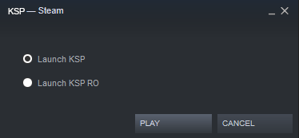

<h2> A Launch Manager for KSP and KSP RO </h2>
<h3> Launch Manager <h3> 
  
  
<h3> Installation </h3> 
  
  <h4> [EN-US] </h4> 
Rename folder "KSP_x64_Data" to "ksp_Data" (KSP folder);  
Rename file "KSP_x64.exe" to "ksp.exe" (KSP folder);    

Create a "KSP_x64.exe" shortcut (KSP RO folder),  
Rename it to "kspRO",  
Throw it in the KSP folder;  

Unzip KSP_x64.rar (too big for one commit);  
Renomear o "KSP_x64PT.exe" para "KSP_x64.exe"; 
Throw "KSP_x64.exe" in the KSP folder;   
  
  <h4> [PT-BR] </h4>
Renomear pasta "KSP_x64_Data" para "ksp_Data" (pasta KSP);  
Renomear arquivo "KSP_x64.exe" para "ksp.exe" (pasta KSP);    

Criar um atalho do "KSP_x64.exe" (pasta do KSP RO),  
Renomea-lo para "kspRO",  
Joga-lo dentro da pasta do KSP;   

Descompactar KSP_x64.rar (muito grande para um commit);  
Rename "KSP_x64EN.exe" to "KSP_x64.exe";  
Jogar o "KSP_x64.exe" para dentro da pasta do KSP;
